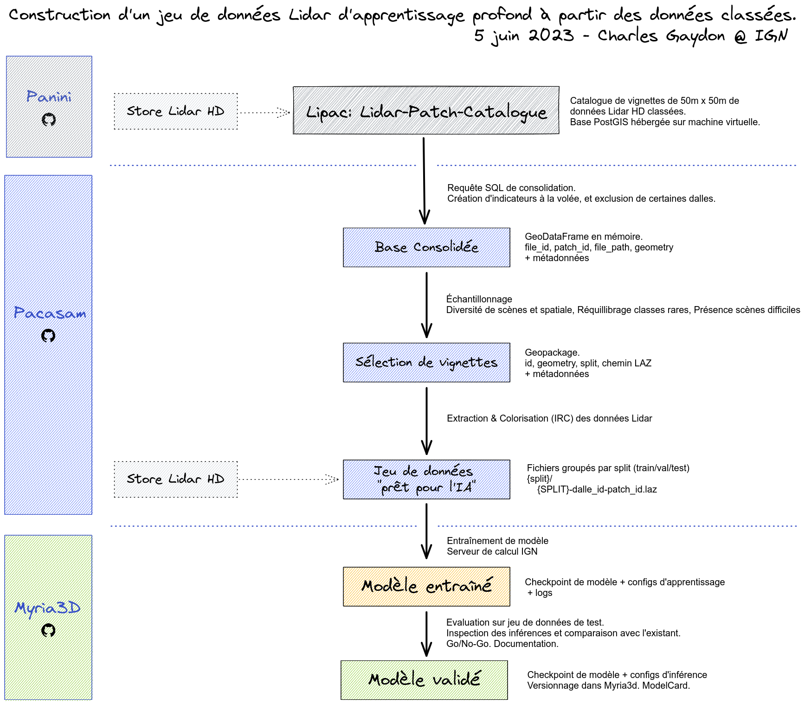
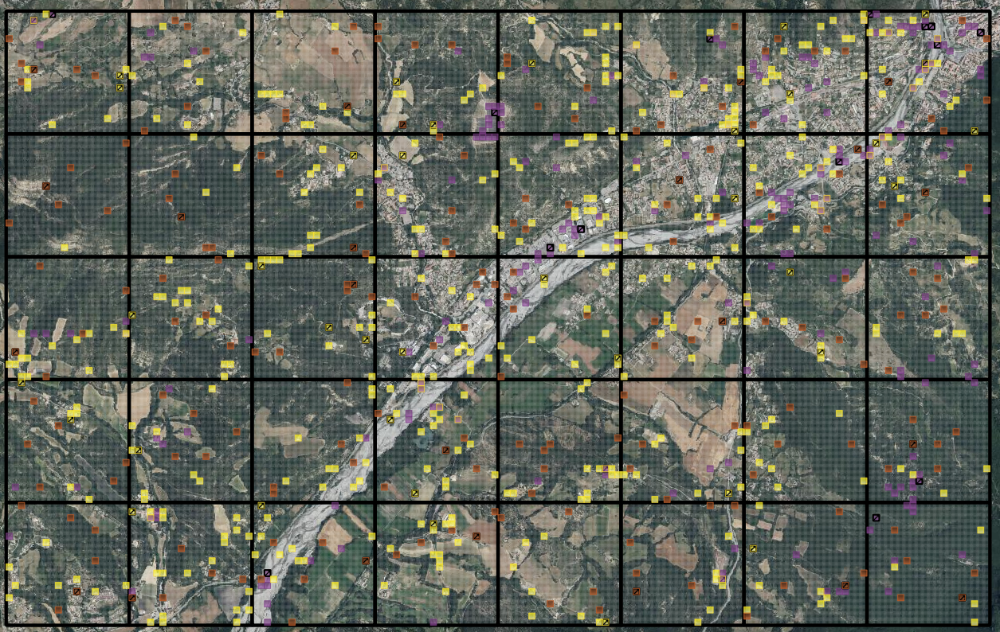
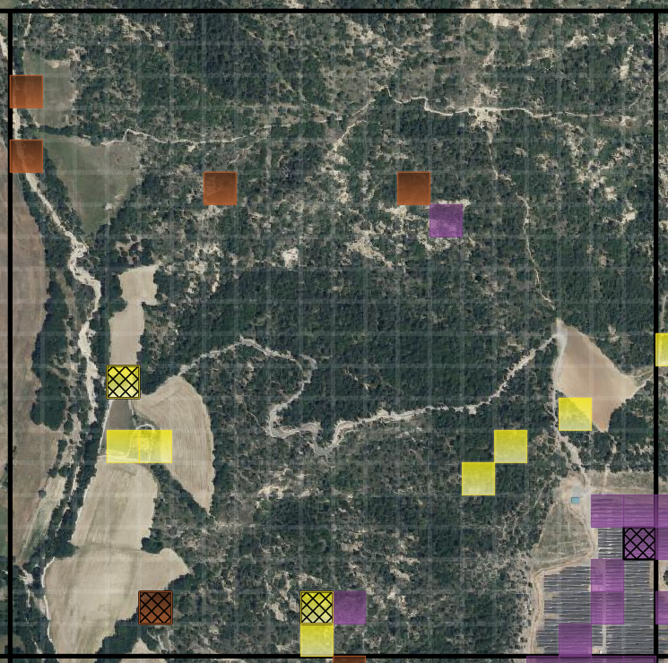
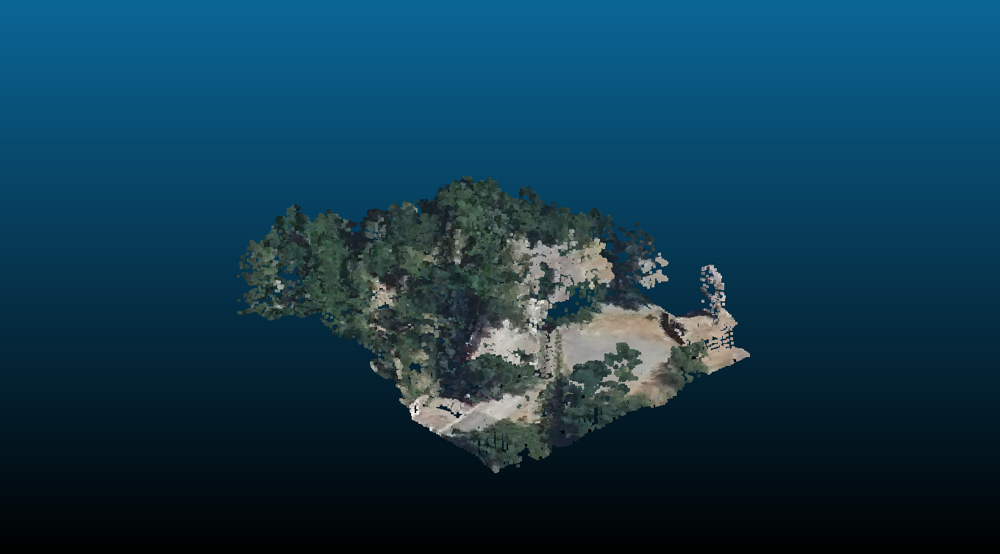
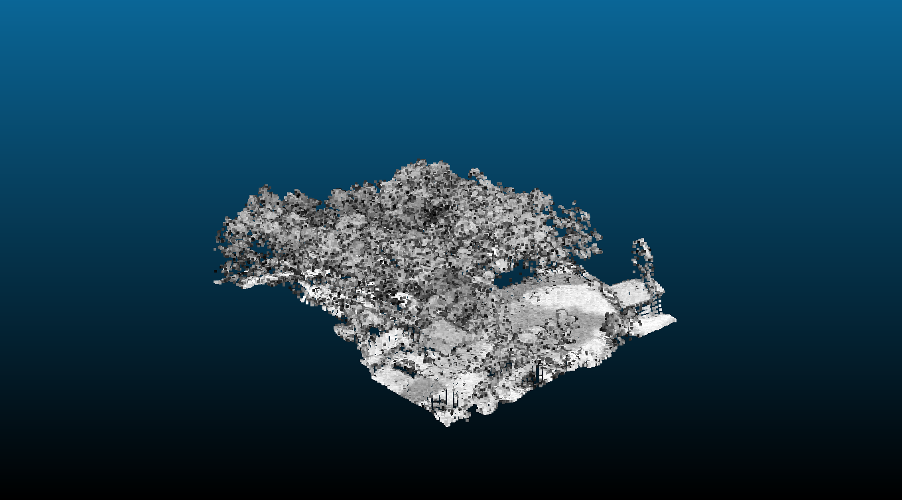
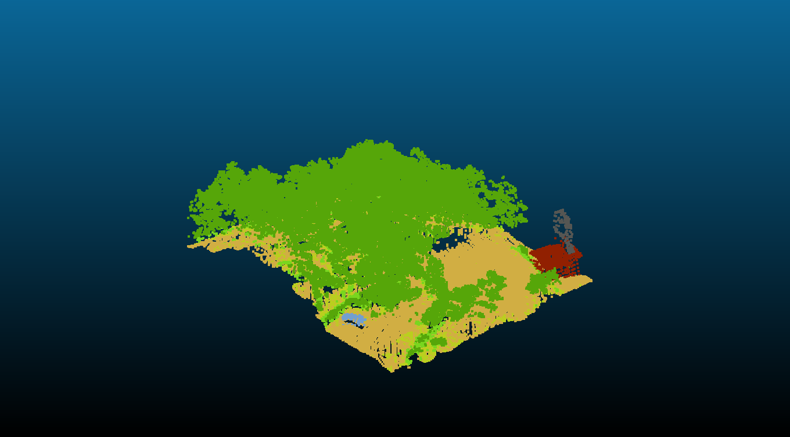
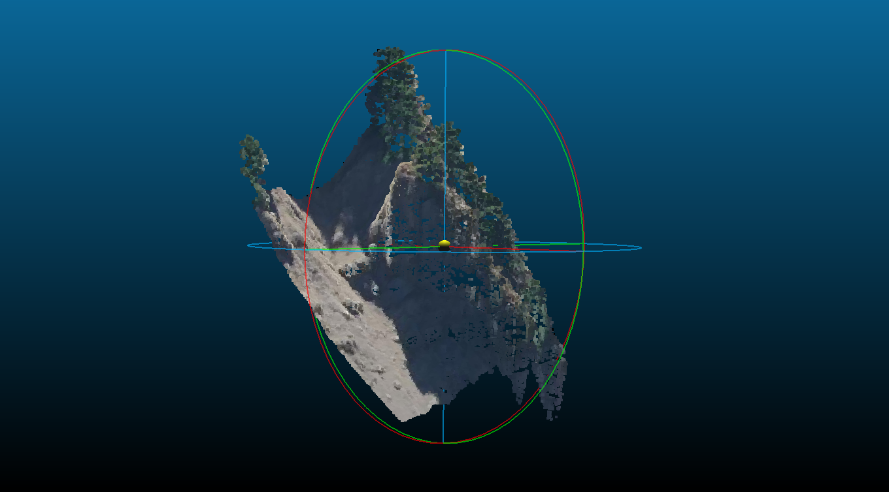
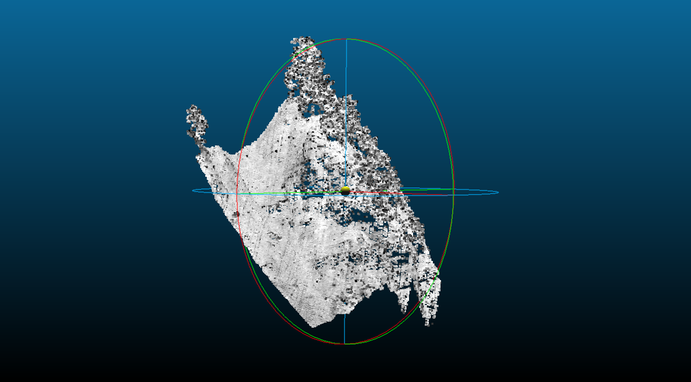
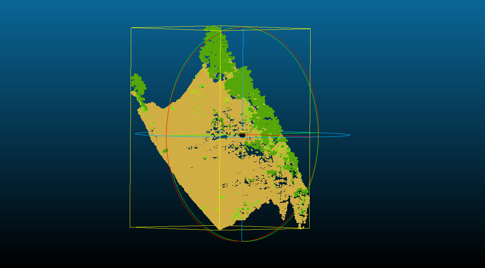

# (Work In Progress) PACASAM: Patch Catalogue Sampling
Le module `pacasam` permet le sous-échantillonnage et l'extraction de patches de données géographiques, pour la création d'un jeu de données d'apprentissages profond.

## Contenu

Les données auront été décrites au préalable dans un "Catalogue" incluant leur emprise géographique, les histogrammes des classes de chaque patch, et des indicateurs de présences de certains objets d'intérêt (p.ex. éoliennes, autoroutes, etc.). Ces métadonnées servent à à échantillonner les données suivant plusieurs heuristiques, avec les cadres conceptuels suivant :

- *Uncertainty Sampling* : on souhaite sélectionner des types de scènes sur lesquelles nos modèles de segmentation sémantique actuels (cf. [myria3d](https://github.com/IGNF/myria3d)) manquent parfois de confiance, voire font des erreurs (p.ex. grands bâtiments).
- *Rééquilibrage* : on souhaite atteindre de bonnes performances sur certaines classes rares (p.ex. eau, sursol pérenne) et objets rares (p.ex. éoliennes, lignes à haute tension, chemin ferroviaires), en augmentant leur prévalence dans le jeu de données.
- *Diversity Sampling* : on souhaite couvrir la grande diversité des scènes possibles. On posera les deux hypothèses suivantes : 
    - (1) Autocorrélation spatiale des scènes : des scènes proches ont tendance à se ressembler plus que des scènes lointaines ; 
    - (2) Les histogrammes des classes de chaque patch sont un proxy (imparfait) de la nature des scènes : sous condition d'une bonne normalisation, on doit pouvoir définir une mesure de distance des scènes à partir des histogrammes de classes, et de là favoriser la diversité des scènes.


<details>
<summary><h4>Objets principaux dans pacasam</h4></summary>

Un sampling se lance au moyen d'un fichier de configuration, et via les objets suivants:

- **Connector**: interface de connexion aux données: 
    - `LiPaCConnector`: connexion et requêtage de la base LiPaC (Lidar Patch Catalogue).
    - `SyntheticConnector`: création d'un GeoDataFrame synthétique, composé de tuiles répartie dans une grille arbitraire, pour effectuer des tests rapidements.
    - `GeopandasConnector`: lecture d'un format compatible avec `geopandas` (geopackage, shapefile...). Usage typique : lecture d'un sampling antérieur, pour l'échantillonner encore plus.
- **Sampler**: interrogent les objets `Connector` suivant la configuration pour sélectionner des tuiles (patches) par leur identifiant, et qui définissent à la volée le split train/test.
    - `TargettedSampler`: atteinte séquentielle des contraintes de prévalence pour chaque descritpteur. Répartition spatiale optimale. La sélection est completée par un sampling spatial pour atteindre le nombre de patches voulu.
    - `OutliersSampler`:  détection des scènes les plus atypiques, via un clustering HDBSCAN (i.e. histogrammes standardisés des classes).
    - `DiversitySampler`: couverture par Farthest Point Sampling de l'espace des descripteurs (i.e. histogrammes standardisés ou quantilisés des classes).
    - `SpatialSampler`: complétion aléatoire pour atteindre une taille de jeu de données cible. Répartition spatiale optimale.
    - **`TripleSampler`**: (1) `TargettedSampled`, puis complétion à part égale avec (2) `DiversitySampler`, et (3) `SpatialSampler`. C'est un compromis entre les trois méthodes. On pourrait envisager d'utiliser `OutliersSampler` en (2) pour encore mieux cibler les éléments atypiques.
    - **`CopySampler`**: un objet permettant la copie complète de la base de données.
- **Extractor**: créeent un jeu de données à partir d'un sampling.
    - `LAZExtractor` : extraction et colorisation (orthoimages RGB+Infrarouge) de patches de Lidar (format LAZ).
    - `BDOrthoTodayExtractor` : extraction de patches d'orthoimages Infrarouge+RGB à partir de la Géoplateforme (format TIFF).
    - `BDOrthoTodayVintage` : extraction de patches d'orthoimages Infrarouge+RGB à partir de sources raster RGB et IRC PDAL-compatibles (format TIFF).

Le processus de sampling sauvegarde un geopackage dans `outputs/samplings/{ConnectorName}-{SamplingName}-train.gpkg`, contenant l'échantillon de vignettes. L'ensemble des champs de la base de données définis via la requête SQL sont présents. S'y ajoutent une variable `split` définissant le jeu de train/val/test pour un futur apprentissage, et une variable `sampler` précisant le sampler impliqué pour chaque vignette. Des statistiques descriptives sont également disponibles au format csv sous le chemin `outputs/samplings/{ConnectorName}-{SamplingName}-stats/`.


</details>

## Schéma et Illustrations

<details>
<summary><h4>Schéma : cas des données Lidar HD</h4></summary>



</details>

<details>
<summary><h4>Illustrations QGIS - Echantillonnage par TripleSampler</h4></summary>

- A partir de 40 dalles voisines, c'est-à-dire 16000 patches en tout, 893 patches sont échantillonnées, soit environ 6% de la zone.
- Chaque sampler apporte sa contribution (`TargettedSampler`: jaune, `DiversitySampler`: violet, `SpatialSampler`: marron)
- Les zones de bâti et d'eau sont bien représentées, conformément à la configuration de l'échantillonnage.
- Les tuiles du jeu de test sont quadrillées (zoom nécessaire). Elles sont réparties de façon homogène dans le jeu de données, et ce pour chaque sampler :
    - Spatiallement `TargettedSampler`: on couvre un maximum de dalles pour chaque critère.
    - Par les histogrammes de classes pour le `DiversitySampler`, afin que le jeu de test couvre le même espace des histogrammes que le jeu de train, mais simplement de façon moins dense.
    - Spatiallement pour le `SpatialSampler`: on couvre un maximum de dalles.



- Sur la dalle suivante, le `DiversitySampler` (violet) se concentre sur les panneaux solaires au sud-est. Cet exemple illustre la capacité de ce sampler à identifier des scènes atypiques pour les inclures dans le jeu de données.
- Les zones de bâti sont couverte par trois patches choisis par le `TargettedSampler` (jaune), dont une de test (quadrillage).
- Au sein d'une seule dalle, le choix du `SpatialSampler` se fait de façon aléatoire, ce qui sélectionne des zones plus naturelles et forestières (marron). 



</details>

<details>
<summary><h4>Illustrations CloudCompare - Exemples de patches extraits et colorisés</h4></summary>

Couleurs (RVB)             |  Intensité             |  Classification
:-------------------------:|:-------------------------:|:-------------------------:
  |    |  
  |    |  

</details>


## Usage

### Mettre en place l'environnement virtual avec Anaconda:
```bash
conda install mamba --yes -n base -c conda-forge
mamba env create -f environment.yml
```

### Tester toutes les méthodes sur des données synthétiques
```bash
conda activate pacasam
make all CONNECTOR=SyntheticConnector CONFIG=configs/Synthetic.yml REPORTS=N
```

### Lancer un échantillonnage "triple" sur des données synthétiques :
```python
conda activate pacasam
python ./src/pacasam/run_sampling.py --config_file=configs/Synthetic.yml --connector_class=SyntheticConnector --sampler_class=TripleSampler
```

### Lancer un échantillonnage sur des données réelles - base LiPaC et extraction d'un jeu de données Lidar colorisé

1. Créer sa configuration dans le dossier `configs` (cf. `configs/Lipac.yml`). Vérifier notamment les champs liés à la base de données PostGIS à requêter.

2. Repartir du template de fichier d'environnement :
```bash 
cp .env.example .env
```

Modifier les champs `LIPAC_LOGIN` et `LIPAC_PASSWORD` pour remplir les éléments de connexion au catalogue de patch (droits en lecture nécessaires).

3. (Optionnel) Afficher les options de sampling. 

```bash
conda activate pacasam
python ./src/pacasam/run_sampling.py --help
```
Par défaut la base LiPaC est interrogée.

4. Lancer le sampling par défaut (LipacConnector, TripleSampler, split "train"+"val")
```bash
conda activate pacasam
python ./src/pacasam/run_sampling.py
```

L'échantillonnage prend la forme d'un Geopackage sous `"outputs/samplings/LiPaCConnector-TripleSampler/LiPaCConnector-TripleSampler-train.gpkg"`. Le nom du fichier précise que cet échantillonnage a exclu les dalles de Lipac pour lesquelles `test=true` i.e. les dalles réservées pour le jeu de test.

Afin de créer un jeu de données de test, modifier la configuration de la façon suivante : `connector_kwargs.split=test` et `frac_validation_set=null` et lancer à nouveau la commande précédente. Penser à changer également la taille du jeu de données avec `target_total_num_patches`. Cette opération n'incluera dans le sampling que les dalles de Lidar réservées au test. Le fichier obtenu est `"outputs/samplings/LiPaCConnector-TripleSampler/LiPaCConnector-TripleSampler-test.gpkg"`.

5. Visualisation de l'échantillonnage

L'échantillonnage est visualisable dans un SIG, p.ex. QGIS.

6. Lancer l'extraction du jeu de données : extraction des patches et colorisation IRC

Pour tester l'extraction sur le jeu de données de test, lancer
```bash
conda activate pacasam
make extract_toy_laz_data
make extract_toy_laz_data_in_parallel  # multiprocessessing via MPIRE
```

Passons maintenant à une extraction depuis un sampling Lipac.
Dans Lipac, les chemins vers les fichiers LAZ correspondent à un data store Samba. **Ces chemins seront modifiés dynamiquement en faisant l'hypothèse d'un montage en local du store à l'emplacement suivant** : `/mnt/store-lidarhd/`.

Pour lancer l'extraction de façon parallélisée à partir du sampling "Triple" à l'emplacement par défaut, sur 45 coeurs:

```bash
conda activate pacasam
SAMPLING_PATH="outputs/samplings/LiPaCConnector-TripleSampler/LiPaCConnector-TripleSampler-train.gpkg" \
DATASET_ROOT_PATH="/var/data/${USER}/pacasam_extractions/laz_dataset/" \

python ./src/pacasam/run_extraction.py \
			--sampling_path ${SAMPLING_PATH} \
			--dataset_root_path ${DATASET_ROOT_PATH} \
            --num_jobs 45
```

L'extraction peut être reprise en cas d'interruption avec la même commande, sans risque de données corrompues (toutes les opérations sont atomiques).

### Jeu d'apprentissage et jeu de test

Pour un apprentissage automatique, on peut créer deux configuration distinctes, p.ex. `Lipac_train.yml` et `Lipac_test.yml`, qui vont différer par:
    - `target_total_num_patches`: taille du jeu de données souhaité, en vignettes.
    - `frac_validation_set`: Proportion souhaitée de vignettes de validation dans le jeu `trainval`. Les vignettes de validation sont choisies de façon optimale pour chaque méthode d'échantillonnage (répartition spatiale et diversité). Pour le jeu de test, cette valeur n'a pas d'importance et peut être mise à `null` pour que la colonne `split` dans l'échantillonnage final prenne la valeur `test`.
    - `connector_kwargs.split` : `train` ou `test`. On souhaite que les jeux `train` et de `test` soient échantillonnées sur des zones bien distinctes (voir [karasiak 2022](https://link.springer.com/article/10.1007/s10994-021-05972-1) sur cette nécessité). Préciser le split conduit à un filtre sur l'attribut `JEU_DE_DALLES.TEST` dans Lipac. Si `split=train`, les dalles pour lesquelles `JEU_DE_DALLES.TEST==True` seront exclues de l'échantillonnage. Et inversement, elles seront les seules considérées si `split=test`

Pour les volumes de données Lidar HD (base LiPaC) :
    - On sait que sur des données non-échantillonnées (dalles complètes) les volumes 140km² (train dataset, dont 10km² de validation dataset) et 10km² (test dataset) donnent des modèles satisfaisants.

## Développements

### Tests

Pour lancer tous les tests de façon parallélisée:
```bash
make tests
```

Pour séparer l'exécution des tests lents ou nécessitant les flux (instables) de la géoplateforme, de ceux plus rapides :
```bash
make tests_geoplateforme_or_slow
make tests_quick
```

NB: un timeout d'une minute est appliqué aux tests impliquant la Géoplateforme.

Pour lancer uniquement les tests de sampling à partir de Lidar Patch Catalogue:
```bash
make tests_lipac
```

### Performances & Limites

Passage à l'échelle OK : Tests avec 4M de vignettes (et ~20 variables) sur machine locale avec 7.2GB de RAM -> taille totale en mémoire de 600MB environ pour 4M de vignettes. Le sampling FPS se fait par parties si nécessaires p.ex. par 20k vignettes successives.

Pacasam ne permet que d'extraire des vignettes carrées, et alignées avec les axes X et Y du système de coordonnées de référence.

### Pistes pour améliorer les samplers

- Assurer la spatialisation de FPS dans DiversitySampler. Actuellement : traitement par parties spatialisé : on ordonne par file_id et patch_id, puis les parties peuvent faire a minima 20000 patches, soit 50 dalles. On pourra ordonner par bloc_id également dans le futur, et augmenter la taille des chunks.
- Remplacement purement et simplement de DiversitySampler via FPS, par le OutliersSampler. Cf. pull request de [OutlierSampler](https://github.com/IGNF/pacasam/pull/1) sur les visuels et la comparaison. Simple, élégant, et à combiner avec le reste donnera des résultats intéressants. Essayer ça sur une branche et comparer les performances.
